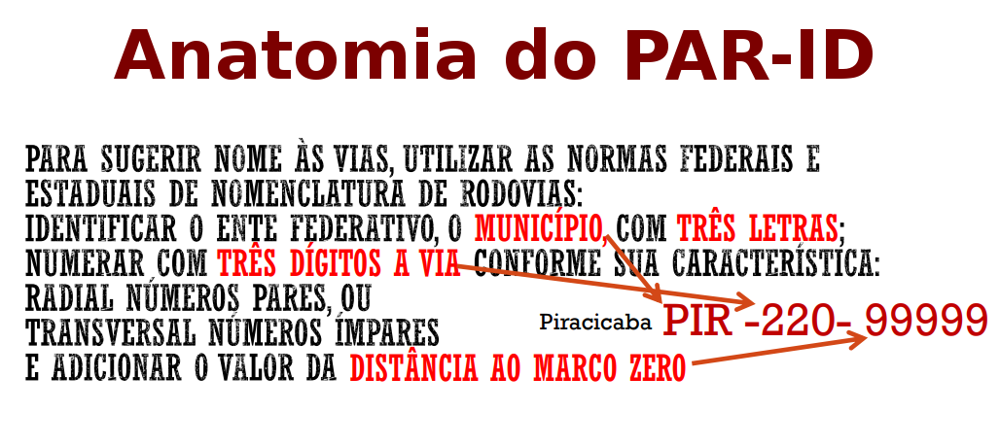

## PAR-ID

*Código de endereço rural* proposto para garantir a informação relativa ao "ponto de acesso à propriedade rural", tipicamente a localização de uma porteira. Teve origem no "Programa de Acessibilidade Rural" da Secretaria da Agricultura e Abastecimento do Governo do Estado de São Paulo. Ainda não recebeu um nome oficial, de modo que estamos apenas apelidando de **PAR-ID**, em referência ao título do seu único documento de apresentação.

Sua meta é garantir acesso aos serviços públicos tais como ambulâncias, polícia, etc. bem como ajudar o morador rural a designar pontos de entrega e estabelecer digitalmente roteiros de entregas no espaço rural.

A proposta de revisão técnica do PAR-ID e de sua integração à rede de dados abertos, incluindo o OSM, dividida nas seguintes partes:

* [Algoritmo de conversão de nome para código de 3 letras](parId-cod3letras.md)
* Codificação das vias
* Numeração ao longo das vias e correção por marcos de referêcnia.
